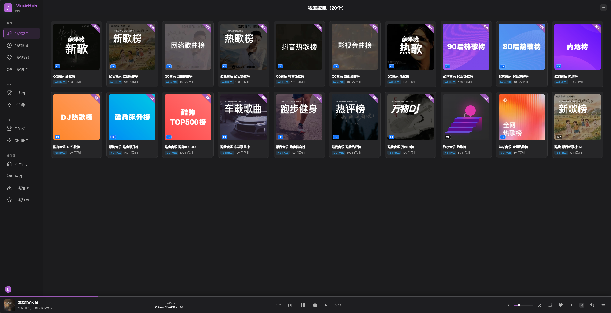
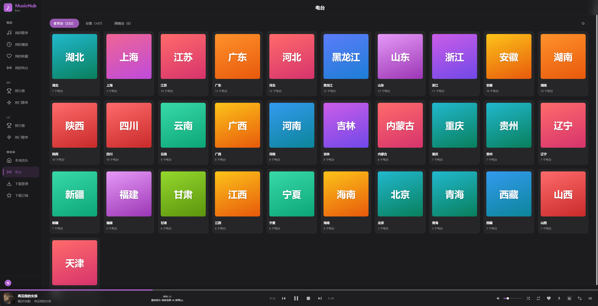
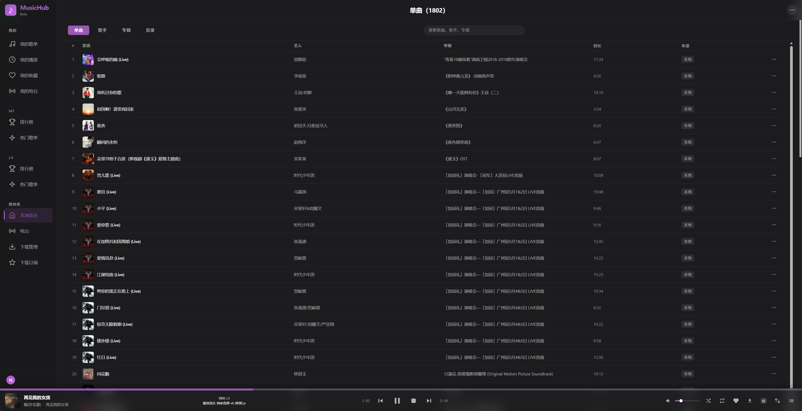
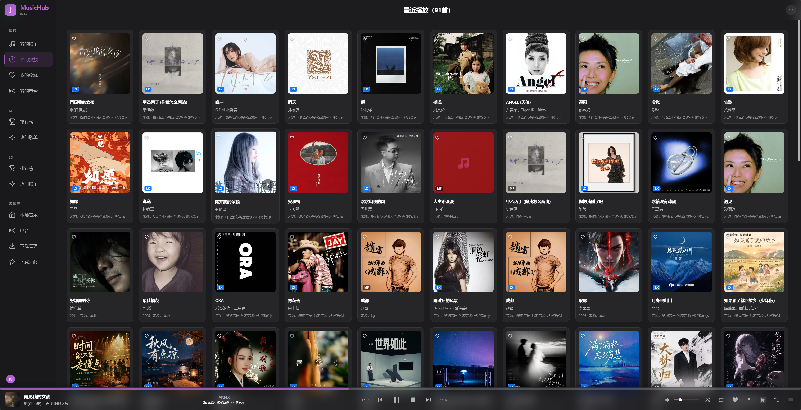
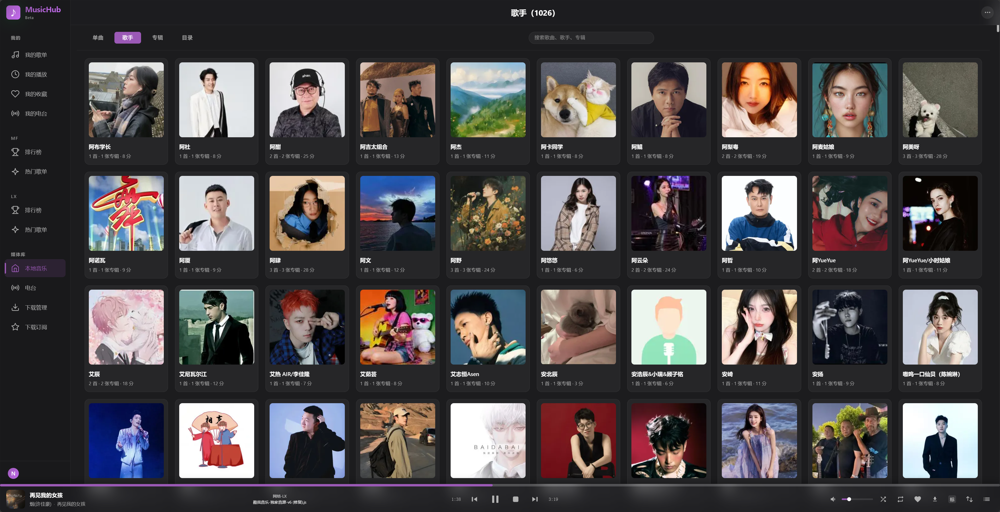
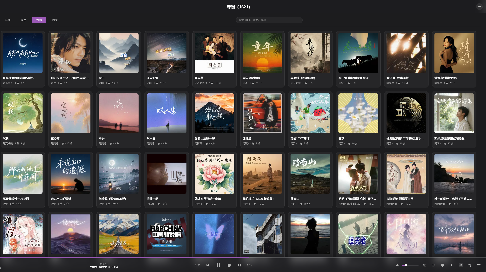
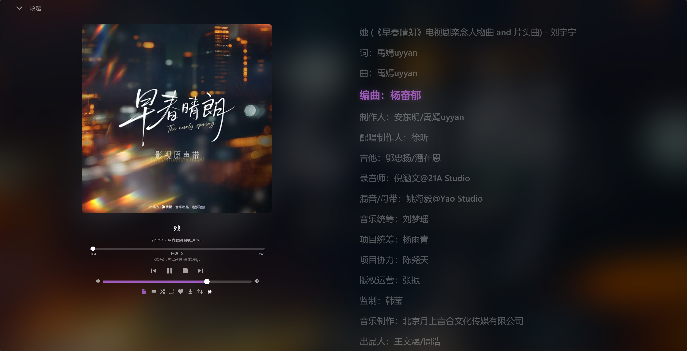
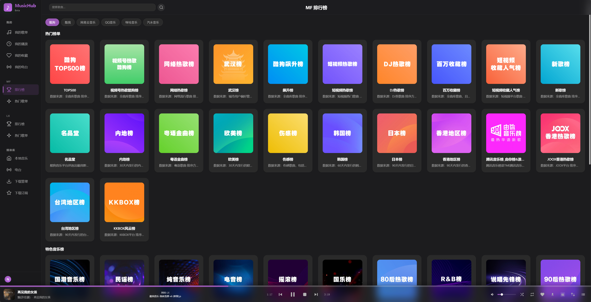

# MusicHub 🎵

自托管音乐流媒体服务器：兼容 **MusicFree 插件生态**，同时提供 **OpenSubsonic** 服务端，自带一个好看的 Web 播放器。Docker 一键部署，你的音乐、歌单、榜单、电台全部聚合在一个界面里。

> 本项目在 **[MusicFree](https://github.com/maotoumao/MusicFree)** 与 **[落雪音乐（lx-music-desktop）](https://github.com/lyswhut/lx-music-desktop)** 的基础上改编而来：MusicFree 的插件协议与运行引擎、落雪的内置音源 SDK 与自定义音源运行时，都在 MusicHub 后端得以复用与延伸 —— 衷心感谢这两个优秀的开源项目。

## ✨ 特性

- **插件生态**：100% 兼容 [MusicFree](https://github.com/maotoumao/MusicFree) 插件，插件热加载（放入目录即生效，无需重启）
- **双音源体系**：
  - MusicFree 插件音源（社区插件自由扩展）
  - 内置 **落雪音乐（lx-music-desktop）音源 SDK**（酷我 / 酷狗 / QQ / 网易 / 咪咕 的榜单、热门歌单、搜索），并兼容落雪**自定义音源**脚本运行时
- **网络音乐聚合**：多音源搜索、榜单浏览（酷狗 / QQ / 酷我 / 酷狗TOP500 / MF 排行榜等）、歌单订阅（榜单快照 / 实时动态歌单）
- **本地音乐库**：自动扫描本地目录，按 单曲 / 歌手 / 专辑 / 目录 聚合，封面、歌词、专辑图自动补全；支持可视分页与模糊搜索
- **网络电台**：省市台 / 分类 / 网络台三维分组，台标上传与 URL 导入，M3U 批量导入导出，全站共享收藏
- **OpenSubsonic 服务端**：完整实现 `/rest` 接口（stream / getCoverArt / search3 / 歌词 / 播放队列 / 电台管理 …），Navidrome 风格的第三方客户端（如 [Amcfy Music 箭头音乐](https://www.amcfy.com/)）可直接连接，电台台标、封面、歌词开箱即用
- **Web 播放器**：播放队列、逐字 / LRC 歌词、封面与歌手头像、收藏、下载缓存、多用户与权限
- **工程化**：SQLite 存储、PUID/PGID 权限对齐、gzip、纯静态前端由后端直接托管，单容器即完整服务

## 🖼 界面预览

| 我的歌单（榜单订阅） | 网络电台 |
|---|---|
|  |  |

| 本地音乐 | 最近播放 |
|---|---|
|  |  |

| 歌手 | 专辑 |
|---|---|
|  |  |

| 播放详情与歌词 | 榜单 |
|---|---|
|  |  |

## 🚀 快速开始（Docker）

**镜像地址（Docker Hub）**：[`gldl137/musichub`](https://hub.docker.com/r/gldl137/musichub)
`beta` 为最新滚动构建；`1.0.x` 为稳定版本 tag，可按需固定。

### 方式一：直接使用镜像（推荐，无需克隆源码）

新建一个空目录，创建 `docker-compose.yml`：

```yaml
services:
  musichub:
    image: gldl137/musichub:beta
    container_name: musichub
    ports:
      - "8000:8000"          # 左边端口可自行修改，如 "8080:8000"
    volumes:
      - ./data:/app/data         # 数据目录（数据库、插件配置、封面缓存、日志等）
      - ./downloads:/app/downloads   # 下载目录
      - ./playlists:/app/playlists   # 播放列表目录（M3U）
      - ./music:/app/music           # 本地音乐目录（本地曲库扫描）
    environment:
      - PUID=1000                # 与宿主机用户对齐，避免挂载目录权限问题
      - PGID=1000
      - TZ=Asia/Shanghai
    restart: unless-stopped
```

```bash
docker compose up -d
```

或使用 `docker run` 一行启动：

```bash
docker run -d --name musichub -p 8000:8000 \
  -v ./data:/app/data -v ./downloads:/app/downloads \
  -v ./playlists:/app/playlists -v ./music:/app/music \
  -e PUID=1000 -e PGID=1000 -e TZ=Asia/Shanghai \
  --restart unless-stopped gldl137/musichub:beta
```

### 方式二：源码构建

```bash
git clone https://github.com/gldl137/MusicHub.git
cd MusicHub
docker compose up -d --build
```

### 启动后

浏览器访问 <http://localhost:8000>

- 默认管理员：`admin` / `admin`（**登录后请立即修改密码**）
- 所有个人数据（数据库、插件配置、封面缓存、收藏等）都在挂载的 `data/` 目录，升级/重建容器不丢数据

### 升级

```bash
docker pull gldl137/musichub:beta
docker compose up -d     # 重建容器，数据保留
```


### 连接第三方客户端（OpenSubsonic / Subsonic）

在任意 Subsonic 兼容客户端（Amcfy Music、Symfonium、Feishin、DSub 等）中添加服务器：

| 配置项 | 值 |
|---|---|
| 服务器地址 | `http://<你的IP>:8000` |
| 用户名 / 密码 | 与 Web 端登录一致 |

## 📁 目录结构

```
MusicHub/
├── docker-compose.yml        # 一键部署（构建 ./app 镜像）
├── 项目介绍/                  # 界面截图（README 引用）
└── app/
    ├── Dockerfile
    ├── backend/              # Node.js 后端（Express + SQLite）
    │   ├── server.js         # 入口
    │   ├── rest/             # OpenSubsonic /rest 实现
    │   ├── routes/           # Web API（音乐/歌单/电台/插件/设置…）
    │   ├── MusicFree/        # MusicFree 插件运行引擎
    │   ├── lib/  core/  services/  scheduler/  migrations/
    │   └── lxmusic/          # 落雪音乐源适配
    ├── frontend/             # 纯静态 Web 播放器（无构建步骤）
    ├── data/                 # 运行时数据（挂载卷，不入库）
    ├── downloads/  music/  playlists/   # 挂载卷（不入库）
    └── scripts/
```

> `app/data`、`app/downloads`、`app/music`、`app/playlists` 为运行时挂载目录，其中的个人数据不会提交到仓库。

## 🔌 安装插件

把 MusicFree 插件 `.js` 文件放入 `app/data/plugins/`（Web 端「插件管理」也支持从 URL 安装），自动加载、无需重启。插件负责提供搜索 / 榜单 / 播放地址 / 歌词 / 封面等音源能力。

## ⚙️ 环境变量

| 变量 | 说明 | 默认值 |
|---|---|---|
| `BACKEND_PORT` | 服务端口 | `8000` |
| `PUID` / `PGID` | 运行用户/组 ID（与宿主机对齐，避免挂载目录权限问题） | `1000` / `1000` |
| `TZ` | 时区 | `Asia/Shanghai` |

## 🙏 致谢

本项目的诞生直接受益于以下两个项目，特此感谢：

- **[MusicFree](https://github.com/maotoumao/MusicFree)** — MusicHub 的插件协议、插件运行引擎（`app/backend/MusicFree/`）与音源能力均改编自 MusicFree，并做了服务端化改造。没有它的插件生态，就没有 MusicHub 的网络音乐能力。
- **[落雪音乐 lx-music-desktop](https://github.com/lyswhut/lx-music-desktop)** — `app/backend/lxmusic/` 即基于落雪的内置音源 SDK（musicSdk）打包改造，支持各平台榜单 / 热门歌单 / 搜索；其自定义音源脚本运行时（`lx` API 沙箱）也与桌面端协议严格对齐，让落雪生态的音源脚本可以直接在 MusicHub 中使用。

同样感谢：

- [Navidrome](https://github.com/navidrome/navidrome) / [Subsonic API](http://www.subsonic.org/pages/api.jsp) / [OpenSubsonic](https://opensubsonic.netlify.app/) — 客户端协议
- [Amcfy Music（箭头音乐）](https://www.amcfy.com/) — 优秀的第三方客户端，兼容性参考

## ⚠️ 免责声明

本项目仅提供播放器与服务端能力，**不提供任何音乐内容**；所有音频均来自用户自行安装的第三方插件接口或用户自备的本地文件。请勿用于商业用途，仅供学习交流。

## License

[MIT](LICENSE)
